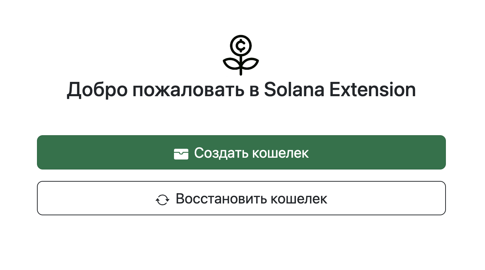

# SOL Chrome Extension  🚀  

The SOL Chrome Extension is a demo example application that demonstrates how to build a Chrome extension using Next.js.

## Table of Contents ✨  

- [Description](#description)
- [Installation](#installation)
- [Usage](#usage)

# Description

The SOL Chrome Extension provides a foundation for building Chrome extensions using Next.js, React, and other related technologies. It showcases the integration of Next.js and Chrome extension development by demonstrating a simple application with multiple pages.



# Installation

To install and run SOL Chrome Extension locally, follow these steps:

1. Clone this repository: 

   ```bash
   git clone https://github.com/Julanick/SOL-chrome-extension.git
   ```
2. Navigate to project directory: 

   ```
   cd SOL-chrome-extension
   ```
3. Install the dependencies using npm: 
   ```
   npm install
   ```

# Usage
## Usage Locally  🔥
To run the SOL Chrome Extension locally, follow these steps:

Run the project:
```
npm run dev
```
`This will run project on your localhost`

 http://localhost:3000/

## Build and Import To Chrome 🔥
To build and import the SOL Chrome Extension to chrome browser, follow these steps:

1. Build the project:
```
npm run build
```
`This will run prep and export to create new folder 'out/', and rename '_next' forlder to 'next' (without underscore)`

2. Open Google Chrome and go to chrome://extensions.

3. Enable the "Developer mode" toggle switch.

4. Click on "Load unpacked" and select the out folder generated by the build process.

5. The SOL Chrome Extension should now be loaded as an unpacked extension in Google Chrome.

